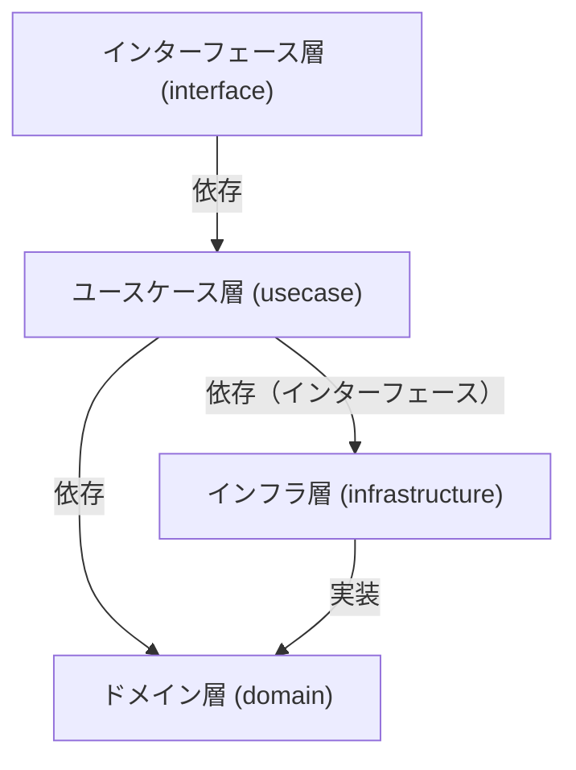

# Clean Architectureサンプル生成指示

以下の要件でGo言語のClean Architectureサンプルを作成してください。

## コード規約
- clean architectureを用いる
- インデントはtab1個にする

### 命名規則
- internal/domain
    - インターフェースは用途が分かるシンプルな名前（例：UserRepository）
- internal/interface
    - 実装構造体は用途が分かる名前（例：FileUserRepository, MemoryUserRepository など）
    - 汎用的な実装名が必要な場合はImpl（例：UserRepositoryImpl）も許容する

## 要件

### 環境構築･ビルド･実行
- makeファイルを通じて実行する
- makeファイルにはhelperをつける

### 言語･フレームワーク･ライブラリ
- Go言語
- clean architectureを実現するフレームワークは用いない
- REST APIには下記のライブラリを使用する
    - net/http
    - github.com/gin-gonic/gin

### 機能
- サンプルのテーマは「ユーザー管理」とする（ユーザーの追加・取得ができる）
- ただし、データベースへのアクセスは行わず、ローカルファイルでデータベースを代替する

### Clean Architectureの構造
- ドメイン層（Domain）：ビジネスルールやエンティティ、リポジトリのインターフェースを定義
- ユースケース層（Usecase）：アプリケーション固有のビジネスロジックを実装
- インターフェース層（Interface）：外部との入出力（Web APIのハンドラー等）を担当
- インフラ層（Infrastructure）：DBやファイルなど外部システムとのやりとりを実装

### ディレクトリ構造
- ドメイン層、ユースケース層、インターフェース層、インフラ層の4層構造とする
- 各層の責務を明確に分離する

```bash
clean-architecture-sample/
├── cmd/
│   └── main.go
└── internal/
    ├── api/            # APIの型
    ├── config/         # 環境変数の設定ファイル
    ├── domain/         # ドメイン層（エンティティ・リポジトリインターフェース等）
    ├── usecase/        # ユースケース層
    ├── interface/      # インターフェース層（ハンドラー等）
    └── infrastructure/ # インフラ層（実装）
```

#### 依存関係（Mermaid図）


### テストコード
- テストはTable Driven Testで記載する

### その他
- DI（依存性注入）を利用する
- 必要に応じてインターフェースを定義する